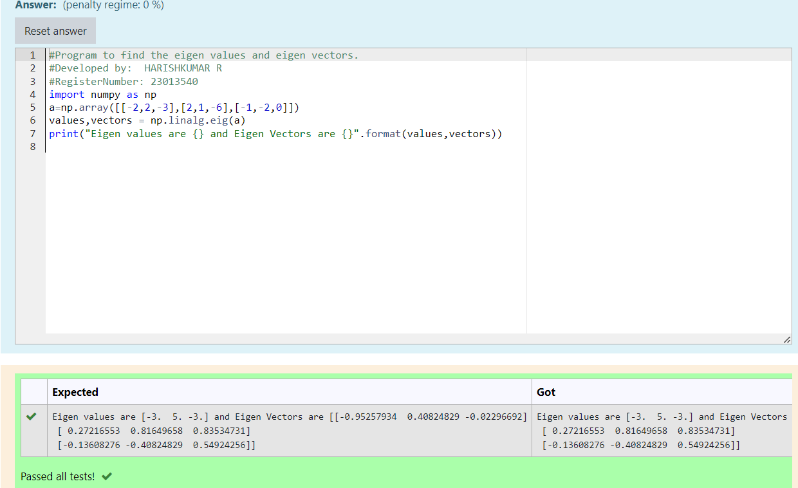

# EIGENVALUES-AND-EIGENVECTORS
## Aim:
To write a python program to find the Eigenvalues and Eigen Vectors
## Equipment’s required:
1. 	Hardware – PCs
2. 	Anaconda – Python 3.7 Installation / Moodle-Code Runner
## Algorithm:
### Step1 : First see the value what was given
### Step 2: use linear algebra import the values
### Step 3: Using the np.linalg.eig(),  we get two results (first is eigenvalue and second is eigenvector) of the given matrix.
### Step 4: Then print the eigen vales
## Program:
```py
#Program to find the eigen values and eigen vectors.
#Developed by:  HARISHKUMAR R
#RegisterNumber: 23013540
import numpy as np
a=np.array([[-2,2,-3],[2,1,-6],[-1,-2,0]])
values,vectors = np.linalg.eig(a)
print("Eigen values are {} and Eigen Vectors are {}".format(values,vectors))

```
## Output:

## Result:
Thus the Eigenvalue and Eigenvector is successfully solved using python program
